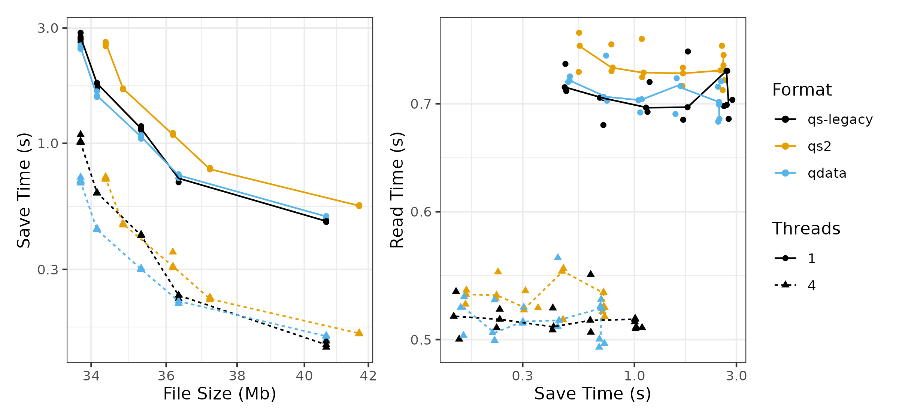
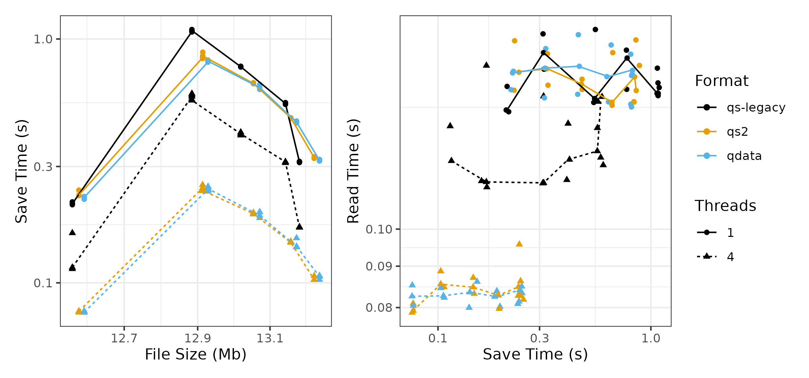
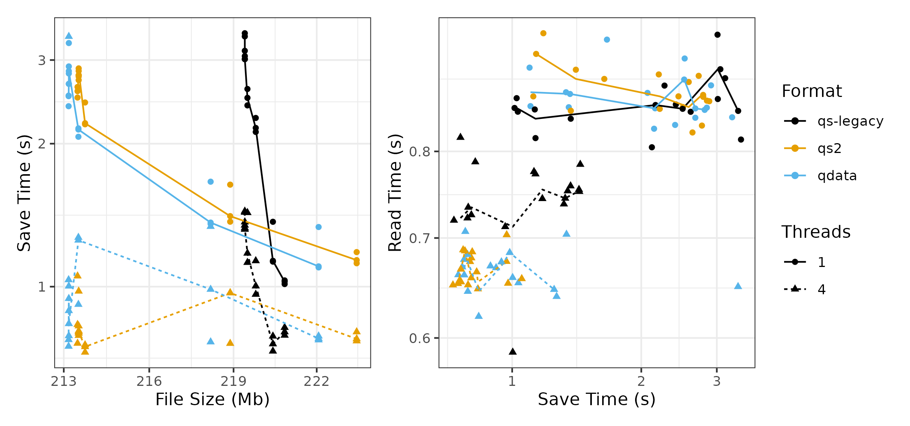

```{r, setup, echo=FALSE}
IS_GITHUB <- Sys.getenv("IS_GITHUB") != ""
```

```{r results='asis', echo=FALSE, eval=IS_GITHUB}
cat('
[](https://github.com/traversc/qs2/actions)
[](https://cran.r-project.org/package=qs2)
[](https://cran.r-project.org/package=qs2)
[](https://cran.r-project.org/package=qs2)
')
```

# Still in development

*qs2: a framework for efficient serialization*

`qs2` is the successor to the `qs` package. The goal is to have cutting edge performance for serialization in R.

The package introduces a new, independent format for saving objects to disk. 

```{r eval=FALSE}
qs_save(data, "myfile.qs2")
data <- qs_read("myfile.qs2")
```

This is a drop in replacement for `qs::qsave` or `saveRDS`. The `qs2` format directly uses R serialization, 
so it should be fully compatible with future versions of R. On top of R serialization, we add multithreading, 
block compression and byte shuffling as in the `qs` package to make it fast. 

# Installation

```{r eval=FALSE}
install.packages("qs2")
```

To enable multithreading on mac or linux, compile from source. 

```{r eval=FALSE}
remotes::install_cran("qs2", type = "source", configure.args = " --with-TBB --with-simd=AVX2")
```

Multithreading uses `Intel Thread Building Blocks` via the `RcppParallel` package. Compared to multithreading in the `qs` package,
this improves performance and safety. 

# The qdata format

This package also introduces the `qdata` format which has its own layout and works with only R data types (vectors, lists, data frames, matrices). 
It will replace internal types (functions, promises, external pointers, environments, objects) with NULL. 
This has slightly better performance but is not general. If you have clean data and understand the caveats, you may want to choose this. 
The eventual goal for `qdata` is to also have interoperability with other languages like `Python`. 

```{r eval=FALSE}
qd_save(data, "myfile.qs2")
data <- qd_read("myfile.qs2")
```

# Converting qs2 to RDS

Because the `qs2` format directly uses R serialization, you can convert it to RDS and vice versa.

```{r eval=FALSE}
file_qs2 <- tempfile(fileext = ".qs2")
file_rds <- tempfile(fileext = ".RDS")
x <- runif(1e6)

# save `x` with qs_save
qs_save(x, file_qs2)

# convert the file to RDS
rds_to_qs(input_file = file_qs2, output_file = file_rds)

# read `x` back in with `readRDS`
xrds <- readRDS(file_rds)
stopifnot(identical(x, xrds))
```

## Benchmarks

TO DO: description of datasets used.

See `inst/benchmarks` for more details and a comparison to other libraries.

### enwik8
```{r echo=FALSE, results='asis'}
if(IS_GITHUB) {
  cat('{width=487px}')
} else {
  cat('{width=487px}')
}
```

### mnist
```{r echo=FALSE, results='asis'}
if(IS_GITHUB) {
  cat('{width=487px}')
} else {
  cat('{width=487px}')
}
```

### gaia
```{r echo=FALSE, results='asis'}
if(IS_GITHUB) {
  cat('{width=487px}')
} else {
  cat('{width=487px}')
}
```
